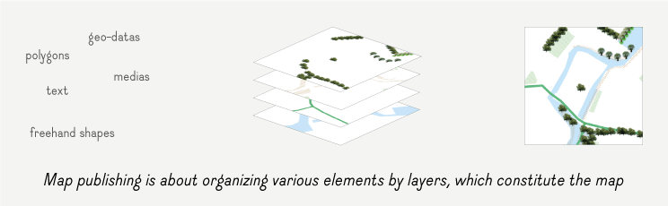
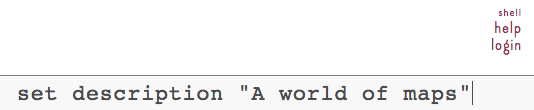
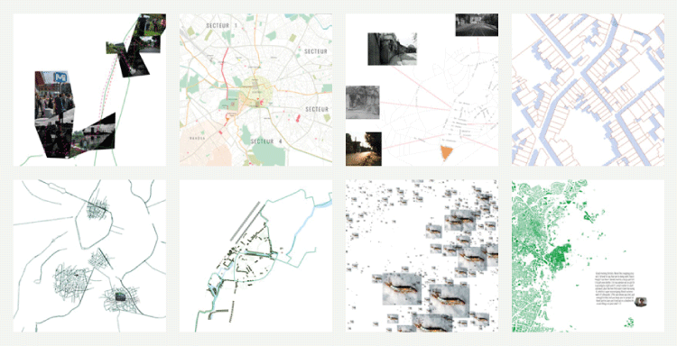
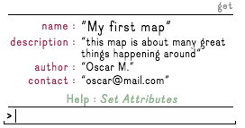
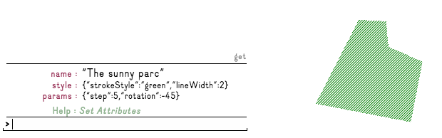
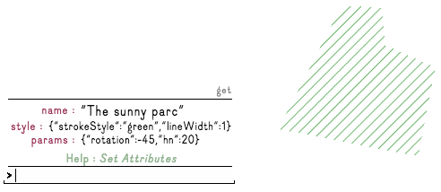
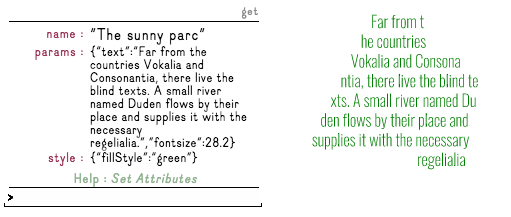
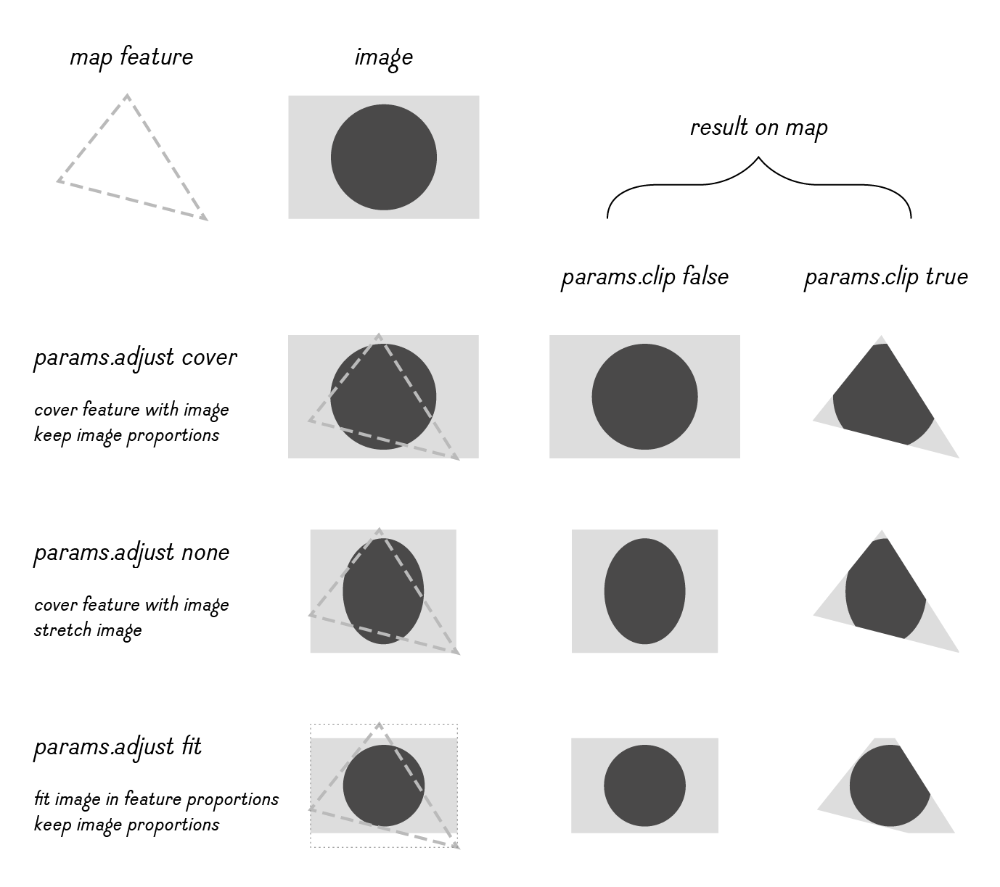
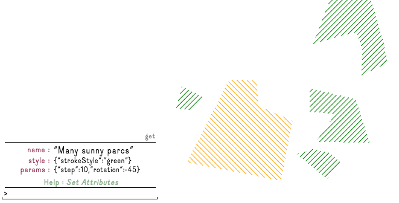
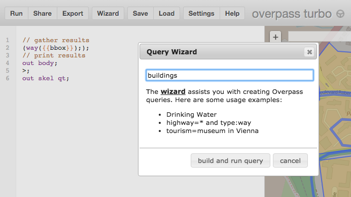

#HELP WÆND

***Wænd is in alpha version, if you like to create a user account, visit http://alpha.waend.com/register.***

This help is improved from time to time, and you can help us by sending your suggestions at contact@atelier-cartographique.be


An ongoing tutorial is available <a href ="http://alpha.waend.com/documentation/waend-tutorial-09-2015_2.pdf" target="_blank">here</a>

1. [Generalities](#generalities)  
1.1  [Logic of map publishing](#logic)  
1.2  [Presentation of Wænd interface](#interface)  
1.3  [Structure of Wænd](#structure)  
1.4  [Datas & Metadatas](#metadata)  

 
2.  [Play with attributes / metadatas](#working-metadatas)  
3.1  [Set attribute (set)](#set)  
3.2  [Get attributes (get)](#get)  
3.3  [Edit attribute (edit)](#edit)  
3.4  [Delete attribute (del)](#del)  
3.5  [Exemple : customize your profile](#profile)  

3.  [Play with features](#feature)   
4.1  [Style your features](#style-feature)   
4.2  [Edit feature geometry](#edit_geometry)  


4.  [Play with layers](#layer)  
5.1  [Style at layer level](#style-feature)  
5.3  [Attach a layer to another map](#attach)  
5.4  [Detach a layer from a map](#detach)   
5.5  [Delete a layer](#delete-layer)   

5. 	[Import Geo-Datas]()  
5.1  [Geo-Datas : Working with GeoJSON](#GeoJSON)    
5.2  [Geo-Datas : Help with Overpass Turbo](#overpass) 

6.  [Style tips & tricks](#style-tips)  
6.1  [HTML color generators ](#tip-colorgenerator)  
6.2  [Polygon fill color](#tip-fill)  
6.3  [Play with Composite Operation](#tip-composite) 

7. [Other]()   
7.1  [Searching maps on Wænd](#search)   
7.2  [Sharing maps](#share)  
7.3  [Embedding a map in another web-page](#embed)  
7.4  [Batch import geo-tagged images](#batch-img)   
7.5  [Create and import images tiles](#tiles) 
 
8.  [Memento : List of common commands](#commands-list) 


 


## <a name="generalities"></a>Generalities

###<a name="logic"></a>logic of map publishing



###<a name="interface"></a>Presentation of Wænd interface 
There are two surprising aspects you will discover : 

- While most of the actions can be done by clicking on the menu buttons, the main tool to work on Wænd so far is a command line. To fully use the plateform, you will have to use this command line interface. Try it, it’s easy and you won’t break anything. The different commands are listed in this Help section.


  
*exemple of command, used to set the description of an element*


- There is no map background : you will start on a blank page. It’s not a bug, but a choice we’ve made to wide-up the spectrum of what cartography could be. No map background means no influence from us on how a territory should be represented. You can do whatever you want.  

  
*exemple of maps created with wænd* 


###<a name="structure"></a>Wænd structure

Waend structure is pretty simple, it goes like russian dolls : 

User account / Map  x / Layer y / Feature z  

A user account host maps.  
A map host layers.  
A layer host features.

We call each of them "context" (User context, map context, etc.)
Features are the most simple a-map élément : like a parc, or an image.
While maps are groups of layers, we also call them "groups".


###<a name="metadatas"></a>Writting informations in Wænd : about datas & metadatas  

There is basicaly two types of informations on wænd : 

1- The datas you use to create your maps (images, texts, geo-datas, etc..). Those are the most visible ones.

2- The informations attached to those elements, the metadatas. 
Here are some exemples of what we call metadatas : 

- the name of your profile  
- the name and the description of your map
- the age of a tree
- the altitude of a building

The meta-data are used at every level on waend : on your profile, maps, layers, and features.

Metadatas are also used to change the style of your features.

The next sections of the help explains how to work with metadatas on Wænd.


#####usage exemples


######1- legend

A first usage of those datas is to give a name to things, a description or other relevant informations, so yourself and your map visitors can read and understand what is your map about.  
It leads to a map legend.


  
*exemple of personalized metadatas*


######2- style and parameters

A second usage, is about styling your datas.  
Eg : If you want a green park, you have will have to set this color infomation to your park feature.

  
*exemple of style and parameters metadatas*


 


## <a name="working-metadatas"></a> Play with attributes / metadatas


### <a name="set"></a> Set attribute : ```set```
Set attribute to current context (user, group, layer or feature).

Use ```set``` to qualify things, to give informations about your maps, etc.

Multiple words must be surronded by "quotes".

Example :

	set name my-element-name
	set description "here is my description"
	set "city population" 1000000


### <a name="get"></a> Get attributes : ```get```
The command ```get``` is very usefull : it displays all attributes from current element.

You can also specify wich attribute value you want to show. 
 
Examples :

```get``` will show all the attributes of the current context
  
```get name``` will show the value of the ```name``` attribute


### <a name="edit"></a> Edit : ```edit```
There is no *edit* button yet, but the functionality is here.  
To edit a specific attribute, we use the pipe ```|``` sign to chain commands together :

	get attribute_name | edit | set attribute_name

Eg :  ```get name | edit | set name``` will *get the name value*, *open the editor* with the name value in it, and *set the new value* as name. 


### <a name="del"></a> Delete attribute: ```del attributeName```

The command ```del attributeName``` will remove the attribute.

Example:

	del description
	or
	del name


### <a name="profile"></a> Exemple : customize your profile

1- Click on the USER link in the menu to go in your user context.  
2- In the command line, type ```set name "the name you want on Wænd"``` and press enter to validate.  
3- Then type ```get```. Your name is here !  
4- You can add more informations on your profile doing this way, it's completely free. Just remember that your profil is public.  


## <a name="feature"></a> Play with features


### <a name="style-feature"></a>Style your features


#### 1- Style hatches

Used commands : 

Line color :  ```set style.strokeStyle``` + any html color value  
Line width :  ```set style.lineWidth``` + number (in meter)

hatches number :  ```set params.hn``` + number  
hatches rotation :  ```set params.rotation``` + number (angle)
hatches step : ```set params.step``` + number (in meter)

Exemples : 

	line color (value can be any HTML color value): 
 	set style.strokeStyle orange  
	set style.strokeStyle #FF7F00  
	set style.strokeStyle "rgb(255, 127, 0)"  
	set style.strokeStyle "rgba(255, 127, 0, 1)"  
	
	line width : 
	set style.lineWidth 15
	
	Hatches number : 
	set params.hn 32
	
	Hatches rotation :
	set params.rotation -45
	
	Hatches step : 
	set params.step 10

Here is an illustration of what it does :  
  



#### 2- Style text

Used commands : 

Font size :  ```set params.fontsize``` +  number (in meters)  
Font color :  ```set style.fillStyle``` + any html color value 


Exemples : 

	Font size (value in meters): 
 	set params.fontsize 12.6  
	
	Font color (value can be any HTML color value) :
	set style.fillStyle orange  
	set style.fillStyle #FF7F00  
	set style.fillStyle "rgb(255, 127, 0)"  
	set style.fillStyle "rgba(255, 127, 0, 1)"	

Here is an illustration of what it does :  
  



	
#### 3- Style image


Used commands : 

adjust :  ```set params.adjust``` +  none OR cover OR fit (default is "none")  
clip :  ```set params.clip``` + true OR false (default is "true")


Exemples : 

	Adjust : 
 	set params.adjust none  
 	set params.adjust cover  
 	set params.adjust fit  
	
	Clip : 
	set params.clip true
	set params.clip false	

Here is an illustration of what it does :  
  



### <a name="edit_geometry"></a> Edit feature geometry

To edit feature geometry, we use the commands :  
```gg``` to get the geometry of that feature  
```sg``` to save the geometry of that feature  


To edit a feature geometry, type : ```gg | trace | sg```  

To edit + duplicate a feature, type : ```gg | trace | create```  

To re-trace a polygon, type : ```trace | sg```  

To re-draw a freehand line, type : ```draw | sg```
	
To re-draw a freehand shape, type : ```draw | close | sg```


## <a name="layer"></a> Play with layer

### <a name="layer-style"></a> Style at layer level

You can use all the style attribute explained on the feature section at a layer level.  

By doing so your style will apply on *every features* belonging to that layer.  
You can override the layer style at a feature level.


Here is an illustration of what it does :  
  


This style is applied on the layer "Many sunny parcs".
They are all green, with -45° rotation, except one, wich has specific style.


### <a name="attach"></a> attach a layer to a map : ```attach```

If you're the owner of the layer, the command will attach the said layer to a map. It doesn't *move* the layer but will *display* it within this other map.

The argument is made of a valid path to be created.

Let say you are the author of a layerA, and you want to attach it to a mapZ :

```
attach /userZ_id/mapZ_id/layerA_id
```

How it works :

```/userZ_id/mapZ_id``` : the context *where* you want to attach the layer.  

```layerA_id``` : the id of the layer you *own* and you want to attach somewhere.


### <a name="detach"></a> detach a layer from a map : ```detach```

The ```detach``` command *undo* what has been done by the ```attach``` command, and works the same way.

To detach layerA from mapZ, do :

```
detach /userZ_id/mapZ_id/layerA_id
```

### <a name="delete-layer"></a> Delete a layer - See ```detach```

A subtlety about *compositions* ---which is what attachments are called internally--- is that when you create a layer in the context of a group/map, its only relationship to this map is the composition that's created at the same time.  

It does mean that if you're willing to *remove* a layer, at the moment, your best option is to detach it from all maps it's attached to.

##<a name="import"></a> Import Geo-datas

###<a name="GeoJSON"></a> Working with GeoJSON

While Wænd is not meant to be an online Geographic Information System, you can import data within layers and work with them:

We currently only support GeoJSON format.
The restrictions so far are :

- no multipolygons
- no multilines
- no points

An easy way to create a GeoJSON file from your zone of interest is to use <a href="http://overpass-turbo.eu/" target="_blank">http://overpass-turbo.eu/</a>, it is a powerfull online tool quickly export data from OpenStreetMap.

Another option is to use <a href="http://www.qgis.org/en/site/" target="_blank">Qgis</a>, a free and opensource GIS, that you can use for manipulating any kind of geo-datas.

*Good to know* : Your datas should be in EPGS:4326 - WGS84, and we display them in EPSG:3857.  

###<a name="overpass"></a> Tips with Overpass Turbo

Use the wizard to help you building your query :   




Exemples : 

#####Query for buildings in selection box

	[out:json][timeout:25];
	// gather results
	(
	  // query part for: “building”
	  way["building"]({{bbox}});
	  relation["building"]({{bbox}});
	);
	// print results
	out body;
	>;
	out skel qt;
 	
#####Query for all roads in selection box

	[out:json][timeout:25];
	// gather results
	(
	  // query part for: “highway”
	  node["highway"]({{bbox}});
	  way["highway"]({{bbox}});
	  relation["highway"]({{bbox}});
	);
	// print results
	out body;
	>;
	out skel qt;


#####Query for everything in the selection box

 	// gather results
 	(way({{bbox}}););
 	// print results
 	out body;
 	>;
 	out skel qt;
 	

##<a name="style-tips"></a> Style tips & tricks

###<a name="tip-colorgenerator"></a>HTML Color generators

Many colors generators exists online, giving you the HTML value you would need. 

Here are two of them: [coolors.co](https://coolors.co/) and [paletton.com](http://paletton.com/)


###<a name="tip-fill"></a> polygon fill color

Set ```params.hn``` key to 1 (One line to this polygon).  
Set ```style.lineWidth``` to 3000 (the line will be 3000m wide)

You are done with a filled polygon !

###<a name="tip-composite"></a> Play with Composite Operation

We use multiply compositing mode by default in layers.  
If you want to change it, please refer to [Canvas MDN documentation] (https://developer.mozilla.org/en-US/docs/Web/API/CanvasRenderingContext2D/globalCompositeOperation)

Exemple for no compositing :

	set style.globalCompositeOperation source-over
	
### <a name="image"></a>Image at layer level

If you set an image at the layer level, it will cover *all* your polygons with this image in that layer.  
The parameters are used like described above, at the layer level.

To do so, type at a layer level :  

```media pick | set params.image```


##<a name="share"></a> Sharing maps

###<a name="view"></a> Share map link in "view mode"

To see your map published, use the command ```view``` or replace ```map``` by ```view```in the URL.   
To share a map, you can just send the url containing ```view``` of your map.  
eg : ```http://alpha.waend.com/view/a3035739-6f38-47a9-a283-5845d6030a68/3bfca7f9-4fe7-44fd-afdd-ffb442df6994```


###<a name="embed"></a> Embedding a map in another web-page

You can embed maps in web pages using iframes.  
To embed your map in view mode, you have to replace ```map```by ```view``` at the begining of the URL.  

Your iframe will look like : 

	<iframe style="position: absolute; top: -9999em; visibility: hidden;" onload="this.style.position='static'; this.style.visibility='visible';" src="http://alpha.waend.com/map/a3035739-6f38-47a9-a283-5845d6030a68/3bfca7f9-4fe7-44fd-afdd-ffb442df6994?c=view" height="600px" width="1000px"></iframe>
 
 
##<a name="batch-img"></a>Batch import geo-tagged images
  
So far, batch import of geotaged images is not supported natively in Wænd. But there is a workaround. Here is a how to, using Qgis :

- install the experimental Qgis pluggin "Geotag and import photos".
- import your geo-tagged images in Qgis, you will get points with the path to your images as an attribute (like ***pathAttribute***).
- transform your points into polygons using the Buffer function. You can set the buffer distance according to the size you want your images to be in Wænd (like 5m for trees illustrations..).
- export your polygons in GEOjson.
- edit the GEOjson file with a code editor, and change the image path the way they are stored on Wænd (yourUserId/ImageNameWithoutExtension).
- Upload your images on Wænd
- Import your edited GEOjson in a new layer
- At this layer level, set the image path for every feature like this : ```set params.image @pathAttribute```
- And voilà ! You can continue to style your images at a layer level, according to your needs.

##<a name="tiles"></a>Create and import images tiles

Following the logic as described above, you can import tiles when you need a very big and zoomable image. 

Using QGIS, you will need to :  

- work on a project in EPSG:3857 (projection used in Wænd)
- geo-locate you image / raster 
- use gridSplitter plugin to split the raster 
- create a tile index shapefile from the tiles with image path key checked
- Export tile index in geoJSON (WGS84 : Wænd datas are stored in this projection)
- Modify the geoJSON file to replace the images path with Wænd img path (userID/image-name-without-extention)
- Export tif tiles in jpg or png to reduce files size
- Import exported tiles in waend
- Import the modified GEOjson in your layer
- At layer level : ```set params.image @your-image-path-key``` (default would be "@location")

Do not forget to work in EPSG3857 in Qgis and to export your GEOjson in WGS84, otherwise you will get glitches. 
	
	
## <a name="commands-details"></a> Memento : List of common commands

#####General attribute commands : 

 ```set``` : set something to something, often attribute to current context  
```get``` : get current context attributes / metadatas   
```edit``` : open text editor  
```del``` : delete + attribute name to delete  

#####Style commands :
 
Line color :  ```set style.strokeStyle``` + any html color value  
Line width :  ```set style.lineWidth``` + number (in meter)

hatches numbers :  ```set params.hn``` + number  
hatches rotation :  ```set params.rotation``` + number (angle)
hatches step : ```set params.step``` + number (in meter)

Font size :  ```set params.fontsize``` +  number (in meter)  
Font color :  ```set style.fillStyle``` + any html color value  


#####Other commands :

Search on Wænd : ```lookup``` + a word  
Display your map in "view mode" : ```view```

#####Good to know : 

Pipe (|) is allowed to chain commands together.  

e.g: The command ```get name | edit | set name``` will *get the name value*, *open the editor* with the name value in it, and *set the new value* as name.  

