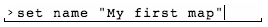

#HELP WÆND

This is a quite rought help for now, it will be improved from time to time.  
Feel free to give a hand !

If you like to create a user acount, visit http://alpha.waend.com/register.


An ongoing tutorial is available <a href ="http://alpha.waend.com/documentation/waend-tutorial-09-2015_2.pdf" target="_blank">here</a>

1.   [Generalities](#generalities)  
1.1  [Logic of map publishing](#logic)  
1.2  [Presentation of Wænd interface](#interface)  
1.3  [Writting informations in Wænd : about datas & metadatas  
](#metadata)

2.   [Common commands](#commands)

3.   [Style attributes and parameters](#keys)  
3.1  [name](#name)  
3.3  [styles (style.)](#style)  
3.4  [parameters (params.)](#params)  
3.5  [hatches number (hn)](#hn)  
3.6  [hatches step (step)](#step)  
3.7  [hatches rotation (rotation)](#rotation)  
3.8  [text](#text)  
3.9  [fontsize](#fontsize)  
3.10 [fontcolor](#fontcolor)  
3.11 [image](#image)

4.   [Commands details](#commands-details)  
4.1  [help](#help)  
4.3  [list commands (lc)](#lc)  
4.4  [set attribute (set)](#set)  
4.5  [get attributes (get)](#get)  
4.6  [edit text (edit)](#edit)  
4.7  [delete attributes (del)](#del)  
4.8  [navigate on map (navigate)](#navigate)  
4.9  [select feature (select)](#select)  
4.10 [draw](#draw)  
4.11 [trace](#trace)  
4.12 [edit geometry](#edit_geometry)  
4.13 [del_feature](#del_feature)  
4.14 [attach a layer to a map](#attach)  
4.15 [detach a layer from a map](#detach)  
4.16 [visibility of layers](#visible)  

5.   [Style tips & tricks](#style-tips)  
5.1  [polygon fill color](#tip-fill)  
5.2  [play with Composite Operation](#tip-composite)  

6.   [Import Datas](#import)  
6.1  [Working with GeoJSON](#GeoJSON)
6.2  [Help with Overpass Turbo](#overpass)


## <a name="generalities"></a>Generalities

###<a name="logic"></a>logic of map publishing


###<a name="interface"></a>Presentation of Wænd interface 
There are two surprising aspects you will discover : 

- While most of the actions can be done by clicking on the menu buttons, the main tool to work on Wænd so far is a command line. To fully use the plateform, you will have to use this command line interface. Try it, it’s easy and you won’t break anything. The different commands are listed in this Help section.
  
*exemple of command, used to set the description of an element*


- There is no map background : you will start on a blank page. It’s not a bug, but a choice we’ve made to wide-up the spectrum of what cartography could be. No map background means no influence from us on how a territory should be represented. You can do whatever you want. 

  
*exemple of maps created with wænd*


###<a name="metadatas"></a>Writting informations in Wænd : about datas & metadatas  

There is basicaly two types of informations on wænd : 

1- The datas you use to create your maps (images, texts, geo-datas, etc..). Those are the most visible ones.

2- The informations attached to those elements, the metadatas. 
Here are some exemples of what we call metadatas : 

- the name of your profile  
- the name and the description of your map
- the age of a tree
- the altitude of a building

The meta-data are used at every level on waend : on your profile, maps, layers, and features.

The next sections of the help explains how to work with metadatas on Wænd.

#####main usage
######1- legend

A first usage of those datas is to give a name to things, eventualy a description or other relevant informations, so yourself and your map visitors can read and understand what is your map about.  
It leads to a map legend.


  
*exemple of personalized metadatas*


######2- style and parameters

A second usage, a bit more complexe is about styling your datas. If you want a blue road, and a green cycle-way you have to set those color infomations to your road and cycle-way.

  
*exemple of style and parameters metadatas*


######3- Processing / custom renderer

A third usage is to use the elements metadatas to batch process the visualization, like using gradient color related to a specific infos (population, age, temperature etc.), real time modifications, and so on.
 

## <a name="commands"></a>Common commands

- help : *help*
- lookup : *lookup + a word will search for maps containing this word* 
- set : *set something to something, often attribute to current context*
- del : *delete + attribute name to delete*
- get : *get current context attributes*
- lg : *list groups*
- ll : *list layer*
- lf : *list features*
- lc : *list command*
- select : *select feature in viewport*
- draw : *draw on map*
- navigate : *navigate on map*
- import : *import GeoJSON file (only imports feature of type "Polygon" and "LineString")*
- media upload : *upload image*
- media list : *browse images*
- media show [image_id]: *show image*
- media pick : *select an image*

Pipe (|) is allowed to chain commands together.
e.g:

```
draw | close | create
```

to draw a line, close it to make a polygon, and save it.
That's what the "draw zone" button does !

```
media pick | set params.image
```
To attach an image to a feature.

## <a name="keys"></a> Style attributes and parameters

Every entities are attached a dictionary.
One manipulates dictionary's values with the ```get```, ```set```,  ```del``` and ```edit``` commands.

For more infos with those commands, see :  

* [set attribute (set)](#set)  
* [get attributes (get)](#get)  
* [del attributes (del)](#del)  
* [edit attributes (edit)](#edit)  

Something to note here, from a key you can reference another key in the same dictionary by prefixing its path with the *@* character, e.g:

```json
{
	"params" : {
		"text" : "@name"
	},
	"name" : "felicity street"
}
```

Something else is that you can address keys which are inside dictionaries with the dot notation, e.g:

```
set style.strokeStyle blue
```

will results in

```json
{
	"style": {
		"strokeStyle" : "blue"
	}
}
```

Note that feature's *style* and *params* dictionaries inherit from their layer's values.

###<a name="name"></a> name

The *name* key is often used across the platform to textualize items, if not found, the system will usually use item's identifier.

###<a name="style"></a> styles (style.)

The style dictionary is expected to hold feature's style informations. Keys here are [CanvasRenderingContext2D](https://developer.mozilla.org/en-US/docs/Web/API/CanvasRenderingContext2D) properties.

color example:

	set style.strokeStyle orange  
	set style.strokeStyle #FF7F00  
	set style.strokeStyle "rgb(255, 127, 0)"  
	set style.strokeStyle "rgba(255, 127, 0, 0.8)"  

line width example:
```
set style.lineWidth 5
```  

**exception**

If you want to play with dashed lines,
setLineDash has to be written our way :
```
set style.lineDash 2 10
```
where 2 is the dash length, and 10 the gap.

###<a name="params"></a> parameters (params.)

Holds parameters to feed the *rendering program*. The default renderer processes the following keys in the *params* dictionary.


####<a name="hn"></a> hatches number (hn)
application: polygon  
number of hatches per polygon (number)

Example:

	set params.hn 150

####<a name="step"></a> hatches step (step)
*application: polygon*  
steps value between hatches (number)

Example:

	set params.step 10

####<a name="rotation"></a> hatches rotation (rotation)
*application: polygon*  
hatches angle (number)

Example:

	set params.rotation 45


####<a name="text"></a> text
*application: line / polygon*  
the text you want to display in a polygon  

Example:

	set params.text "enter your text here"

####<a name="fontsize"></a> fontsize
*application: line / polygon*  
size of the font (number)

Example:

	set params.fontsize 12

####<a name="fontcolor"></a> fontcolor (fillStyle)

Example:

	set style.fillStyle orange  
	set style.fillStyle #FF7F00  
	set style.fillStyle "rgb(255, 127, 0)"  
	set style.fillStyle "rgba(255, 127, 0, 0.8)" 


#### <a name="image"></a> image
*application: polygon*

Set an image to be inserted at the polygon's location.

```params.clip``` boolean (default to true)

```params.adjust``` 'none' or 'fit' or 'cover' (default to 'none')

## <a name="commands-details"></a> Commands details

### <a name="help"></a> help
get help

### <a name="lc"></a> list comands (lc)
list commands  

### <a name="set"></a> set attribute (set)
set attribute to current element (user, group, layer or feature).

[set] is very usefull to qualify your datas, to give informations about your maps, etc.

Multiple words must be surronded by "quotes".

Example :

	set name my-element-name
	set description "here is my description"
	set "city population" 1000000

### <a name="get"></a> get attributes (get)
get all attributes from current element
get attributeName : get value for attributeName

Example :

	get
	get name

### <a name="edit"></a> edit
There is no *edit* button yet, but the functionality is here.
To edit a key, type :

	get your_key | edit | set your_key

It will get the *your_key* value, open the editor with this value, and set the edited value to *your_key*

To edit *style* or *params* dictionary, do the same with :

	get style | edit | set style
	or
	get params | edit | set params


### <a name="del"></a> delete (del)
Delete an attribute

Example:

	del text

Delete an attribute in *style* or *params*  

For now you need to delete the entire *style* or *params* with :

	del params
	or
	del style


### <a name="navigate"></a> navigate in map (navigate)
navigate in the map viewport  
use keyboard arrows to navigate  
use [i] to zoom in  
use [o] to zoom out

Type [ESC] key to escape this mode.

### <a name="select"></a> select features (select)
select a feature in the viewport

### <a name="draw"></a> draw
draw with on map, usualy pipped with another command  

Example:

	draw | region set

will set the region viewport to the drawing extend


### <a name="trace"></a> trace
trace with on map, usualy pipped with another command.  
Trace is usefull to creat segmented lines and polygons.

keys:
- ```enter``` validate geometry and exit
- ```escape``` cancel geometry and exit
- ```e``` enters edit mode (moving control points)
- ```n``` enters append mode (click to add points)

To create a feature out of it, in a layer context, use :

	trace | create

It will draw a line and create a feature out of it.  
Click on the first point to close the line and make a polygon.


### <a name="edit_geometry"></a> Edit geometry


To edit a feature geometry, use :

	gg | trace | sg

To duplicate a feature, use :

	gg | trace | create


### <a name="del_feature"></a> delete feature (del_feature)

In the context of a feature, and if you're granted to, the command will delete the current feature and bring you back to the parent layer context.

In the context of a layer, you must give a feature ID in argument of the command.

### <a name="attach"></a> attach a layer to a map (attach)

If you're the owner of the layer, the command will attach the said layer to a map. It doesn't *move* the layer but will *display* it within this other map.

The argument is made of a valid path to be created.

```
attach /user_id/map_id/layer_id
```

```/user_id/map_id``` = the context where you want to attach the layer.  
```layer_id```= the layer id.


### <a name="detach"></a> detach a layer from a map (detach)

The ```detach``` command *undo* what has been done by the ```attach``` command, and works the same way.

```
detach /user_id/map_id/layer_id
```

A subtlety about *compositions* ---which is what attachments are called internally--- is that when you create a layer in the context of a group/map, its only relationship to this map is the composition that's created at the same time. It does mean that if you're willing to *remove* a layer, at the moment, your best option is to detach it from all maps it's attached to.


### <a name="visible"></a> Visibility of layers (visible)

On a map context, type ```visible``` to chose which layers to display.


##<a name="style-tips"></a> Style tips & tricks

###<a name="tip-fill"></a> polygon fill color

Set ```params.hn``` key to 1 (One line to this polygon).  
Set ```style.lineWidth``` to 3000 (the line will be 3000px wide)

You are done with a filled polygon !

###<a name="tip-composite"></a> Play with Composite Operation

We use multiply compositing mode by default in layers.  
If you want to change it, please refer to [Canvas MDN documentation] (https://developer.mozilla.org/en-US/docs/Web/API/CanvasRenderingContext2D/globalCompositeOperation)

Exemple for no compositing :

	set style.globalCompositeOperation source-over


##<a name="import"></a> Import data (import)

###<a name="GeoJSON"></a> Working with GeoJSON

While Wænd is not meant to be an online Geographic Information System, you can import data within layers and work with them:

We currently only support GeoJSON format.
The restrictions so far are :

- no multipolygons
- no multilines
- no points

An easy way to create a GeoJSON file from your zone of interest is to use <a href="http://overpass-turbo.eu/" target="_blank">http://overpass-turbo.eu/</a>, it is a powerfull online tool quickly export data from OpenStreetMap.

Another option is to use <a href="http://www.qgis.org/en/site/" target="_blank">Qgis</a>, a free and opensource GIS, that you can use for manipulating any kind of geo-datas.

*Good to know* : Your datas should be in EPGS:4326 - WGS84, and we display them in EPSG:3857.  

###<a name="overpass"></a> Tips with Overpass Turbo

#####Querie for everything in the selection box

 	// gather results
 	(way({{bbox}}););
 	// print results
 	out body;
 	>;
 	out skel qt;
 	